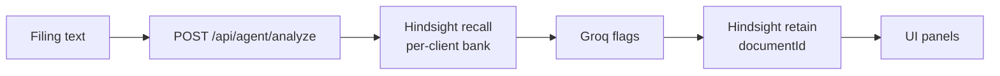

# Compliance Audit Agent

A memory-driven filing auditor: submit a filing, and an agent flags compliance
issues *in light of what it has seen before* — no database, just
[Hindsight Cloud](https://docs.hindsight.vectorize.io) as memory and Groq as
the reasoning model.

The demo pair: *Invoice #4, filed 9 days late* then *Invoice #7, filed 6 days
late*. The first filing gets basic flags; when the second arrives, the agent
remembers the first and escalates ("repeated late filing"). Analyze the same
invoice under a different client and nothing comes back — memory is scoped per
client.

## Stack

- [Next.js](https://nextjs.org) 16 (App Router, TypeScript, Tailwind v4)
- [`@vectorize-io/hindsight-client`](https://www.npmjs.com/package/@vectorize-io/hindsight-client) — retain / recall memory
- [Groq](https://groq.com) (`openai/gpt-oss-120b`) — flag synthesis

## Run it

```bash
npm install
cp .env.example .env.local   # fill in your real keys
npm run dev                  # http://localhost:3000/audit
```

Required env (see `.env.example`):

| Variable | Purpose |
| --- | --- |
| `HINDSIGHT_API_URL` | Hindsight Cloud base URL |
| `HINDSIGHT_API_KEY` | Hindsight Cloud API key |
| `GROQ_API_KEY` | Groq API key |
| `HINDSIGHT_BANK_ID` | Bank id prefix (default `agent-memory-loop`) |

## How Hindsight is used

Hindsight Cloud (`@vectorize-io/hindsight-client`) is the agent's memory — there is no database.

**Bank scoping.** Each client has its own memory bank: `${HINDSIGHT_BANK_ID}-${clientId}`, e.g. `agent-memory-loop-demo-client-1`. Memories never cross clients.

**What gets recalled and injected.** Every `POST /api/agent/analyze` first uses the submitted document text as the recall query (`client.recall`) — before this document is stored, so a fresh bank recalls nothing on first use. The returned facts' texts are rendered verbatim in the "What the agent remembered" panel and injected into the Groq prompt as "Memory of prior documents:" above "Document under review:", so flags are judged against related prior filings — the mechanism behind the Invoice #4 → #7 before/after pair.

**What triggers retain.** Only after recall and flag synthesis does the route store the document via `client.retain`, tagged with the client id — so the next analysis sees it. Retains pass a stable `documentId` (hash of the text), so re-analyzing or retrying the same document replaces its memories instead of duplicating them.

Flag synthesis itself is Groq (`openai/gpt-oss-120b`); upstream failures map to the labeled 5xx contract in `lib/analyze-errors.ts`. `scripts/memory-loop-test.ts` runs a standalone retain → recall → think smoke test.



## Layout

```
app/audit/page.tsx            UI: client + filing pickers, custom text, panels
app/api/agent/analyze/route.ts  the memory loop (recall → think → retain)
lib/hindsight.ts              Hindsight client singleton (env-driven)
lib/demo-data.ts              hardcoded demo clients/filings (no DB)
lib/analyze-errors.ts         error taxonomy + upstream timeouts
scripts/memory-loop-test.ts   standalone loop smoke test
docs/hindsight-explanation.md 150–200 word Hindsight explainer
```
